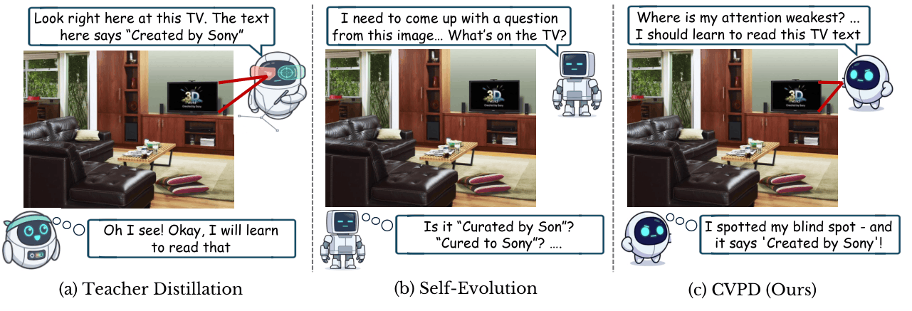
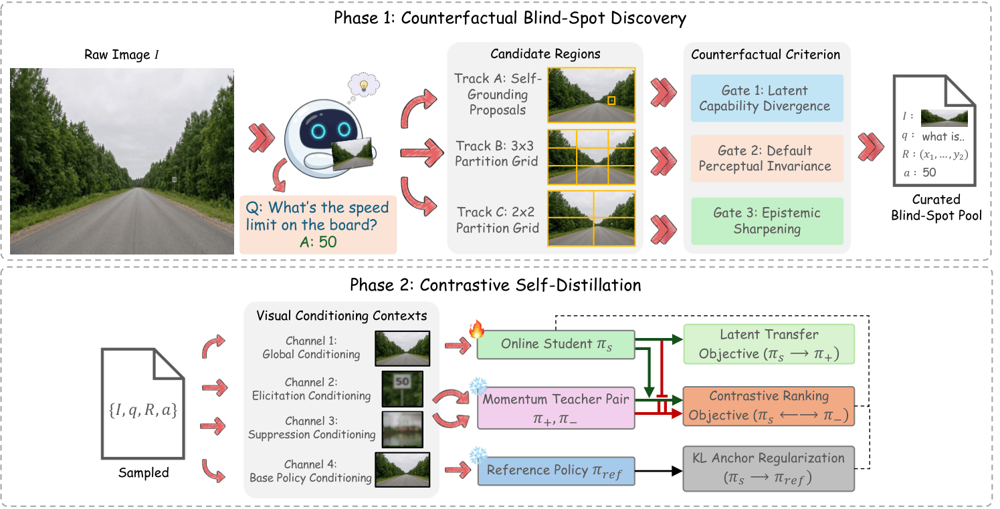
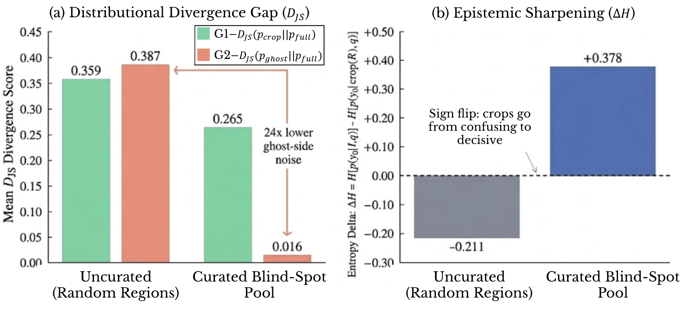
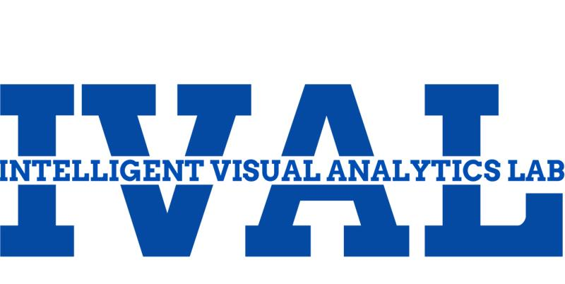

<p align="center">
    
</p>

<div align="center" style="margin:18px 0;">
  
</div>

<h1 align="center">Perception Before Supervision:<br>Self-Contained Visual Distillation from Counterfactual Blind Spots</h1>

<p align="center"><b>CVPD: Contrastive Counterfactual Visual Process Distillation</b> · BMVC 2026</p>

<div align="center">

[](https://mbzuai-oryx.github.io/CVPD/)
[](https://github.com/mbzuai-oryx/CVPD)
[](LICENSE)

</div>

<p align="center">
  <a href="https://shravfolio.vercel.app">Shravan Venkatraman</a><sup>1</sup>,
  <a href="https://omkarthawakar.github.io/">Omkar Thawakar</a><sup>1</sup>,
  <a href="https://scholar.google.com/citations?hl=en&user=9-2AnjQAAAAJ">Ritesh Thawkar</a><sup>1</sup>,
  <a href="https://github.com/Amshaker">Abdelrahman Shaker</a><sup>1</sup>,
  <a href="https://scholar.google.fi/citations?user=_KlvMVoAAAAJ">Rao Muhammad Anwer</a><sup>1,2</sup>
</p>

<p align="center">
  <i><sup>1</sup>Mohamed bin Zayed University of Artificial Intelligence · <sup>2</sup>Aalto University</i>
</p>

---

> **TL;DR.** CVPD finds visual regions that a multimodal model can understand
> when zoomed in but routinely ignores in the full image. The crop becomes a
> positive teacher, the same region ghosted from the image becomes a negative
> teacher, and their token distributions provide dense, self-contained
> supervision without labels, external tools, reward models, or stronger
> annotators.

<p align="center">
  
</p>
<p align="center"><i>
CVPD turns a model's own counterfactual blind spots into dense supervision.
Unlike reward-based self-evolution, it corrects the next-token distribution;
unlike standard visual distillation, it constructs its privileged views without
external annotations or vision tools.
</i></p>

## 📌 Overview

CVPD is a two-phase framework for dense, on-policy visual self-distillation.
Given only raw images, the model first writes a fine-grained question and short
probe answer. It then searches candidate regions from self-grounding, a 3×3
grid, and a 2×2 grid. A region is kept only when all three counterfactual gates
pass:

| Gate | Criterion | Interpretation |
| :-- | :-- | :-- |
| **G1: Latent capability divergence** | `D_JS(p_crop ‖ p_full) ≥ 0.05` | Zooming into the region reveals behavior absent from the full view |
| **G2: Default perceptual invariance** | `D_JS(p_ghost ‖ p_full) ≤ 0.05` | Removing the region leaves the model's inattentive default nearly unchanged |
| **G3: Epistemic sharpening** | `H[p_crop(y₀)] < H[p_full(y₀)]` | The crop makes the first answer token more certain, not merely different |

Passing regions are ranked by crop/full divergence minus ghost/full divergence
plus the crop's entropy reduction. The best region for each image forms a tuple
`(image, question, region, answer)` in the Curated Blind-Spot Pool.

During training, the full-image online student `π_s` follows a crop-conditioned
EMA teacher `π_+`, is pushed away from a ghost-conditioned EMA teacher `π_-`,
and remains anchored to the adapter-disabled reference policy `π_ref`. The
token-level objective is:

`L = D_JS(π_+ ‖ π_s) + λ_rank max(0, m + D_JS(π_+ ‖ π_s) - D_JS(π_- ‖ π_s)) + β D_KL(π_s ‖ π_ref)`

with `λ_rank=0.5`, margin `m=0.1`, and an adaptive KL coefficient targeting
`0.03`.

<p align="center">
  
</p>
<p align="center"><i>
Phase 1 discovers and curates blind spots. Phase 2 uses four visual-conditioning
channels from the same Qwen3-VL backbone for latent transfer, contrastive
ranking, and KL anchoring.
</i></p>

<p align="center">
  
</p>
<p align="center"><i>
The three-gate criterion preserves crop-side sensitivity while reducing
ghost-side divergence by 24× and changing the crop entropy delta from −0.211
to +0.378.
</i></p>

## ✨ Key Results

CVPD improves all twelve reported benchmarks at both the 4B and 8B scales, with
no regression relative to the corresponding Qwen3-VL base model.

**Qwen3-VL-8B-Instruct highlights:**

| Benchmark | Base | CVPD | Δ |
| :-- | --: | --: | --: |
| OCRBench | 82.80 | **86.40** | **+3.60** |
| MMStar Fine-Grained Perception | 60.25 | **63.63** | **+3.38** |
| MMStar Logical Reasoning | 61.69 | **64.77** | **+3.08** |
| CV-Bench | 86.13 | **88.27** | **+2.14** |
| ScienceQA | 90.88 | **92.81** | **+1.93** |
| MMStar Instance Reasoning | 73.03 | **74.87** | **+1.84** |

The offline discovery pass processes 15,000 unlabeled images and retains
approximately 2,590 curated tuples (17.2%). The retained regions combine
self-grounding proposals with systematic 3×3 and 2×2 grid exploration.

## 🚀 Installation

```bash
git clone https://github.com/mbzuai-oryx/CVPD.git
cd CVPD
conda create -n cvpd python=3.10 -y
conda activate cvpd
pip install -r requirements.txt
```

The released configuration targets Qwen3-VL-8B and requires a GPU with
bfloat16 support for practical use. On CUDA or ROCm systems, install the
PyTorch 2.7 build appropriate for your accelerator before installing the
remaining requirements. Authenticate with Hugging Face normally if your
environment requires it; the launchers never store access tokens.

## 🔎 Phase 1: Blind-spot discovery

Place raw, unlabeled images under one directory. CVPD reads pixels only: no
captions, boxes, labels, or answers are used.

```bash
DATA_DIR=/path/to/images \
OUTPUT_PATH=./data/blindspots.jsonl \
bash scripts/discover.sh
```

For a short validation run:

```bash
DATA_DIR=/path/to/images MAX_IMAGES=100 bash scripts/discover.sh
```

The output is resumable. Each processed image receives either one or more
passing records or a `skipped` record with its reason. To retain the statistics
for every evaluated region:

```bash
DATA_DIR=/path/to/images \
DIAGNOSTICS_PATH=./data/candidate_diagnostics.jsonl \
bash scripts/discover.sh
```

The equivalent direct command is:

```bash
python discover.py \
  --data_dir /path/to/images \
  --output_path ./data/blindspots.jsonl \
  --model_name Qwen/Qwen3-VL-8B-Instruct \
  --tau_crop_disagree 0.05 \
  --tau_ghost_agree 0.05 \
  --top_k_logits 100
```

## 🏋️ Phase 2: Contrastive self-distillation

Train on the curated JSONL produced by Phase 1:

```bash
BLINDSPOTS_JSONL=./data/blindspots.jsonl \
RUN_NAME=cvpd_8b \
bash scripts/train.sh
```

`TOTAL_STEPS=-1` is the default and runs one pass over all usable curated
tuples. Override it for controlled ablations or longer runs.

```bash
python train.py \
  --blindspots_jsonl ./data/blindspots.jsonl \
  --model_name Qwen/Qwen3-VL-8B-Instruct \
  --run_name cvpd_8b \
  --total_steps -1 \
  --lora_r 32 \
  --lora_alpha 64 \
  --lr 2e-5 \
  --lambda_rank 0.5 \
  --margin 0.10 \
  --kl_target 0.030 \
  --ema_alpha 0.05
```

By default, training teacher-forces the deterministic probe answer saved during
discovery, so every policy is compared at identical token positions. Pass
`--no_cached_answer` to generate a fresh student rollout instead.

**Paper configuration:** LoRA `r=32, α=64, dropout=0.05` · AdamW
`lr=2e-5, wd=0.01` · gradient clip `1.0` · EMA coefficient `0.05` · top-K
union `K=100` · 448×448 full/crop/ghost views · frozen vision encoder ·
bfloat16.

## 📂 Repository structure

```text
CVPD/
├── discover.py              # Phase 1 CLI
├── train.py                 # Phase 2 CLI
├── scripts/
│   ├── discover.sh          # ready-to-edit discovery launcher
│   └── train.sh             # ready-to-edit training launcher
├── cvpd/
│   ├── core.py              # shared image contexts and model wrappers
│   ├── discovery.py         # candidate generation and three-gate curation
│   ├── objective.py         # top-K JSD, ranking, and KL losses
│   └── training.py          # curated pool, trainer, logging, and checkpoints
├── requirements.txt
└── assets/
```

## 🙏 Acknowledgements

CVPD builds on the [Qwen3-VL](https://huggingface.co/Qwen) family and the
🤗 [Transformers](https://github.com/huggingface/transformers) and
[PEFT](https://github.com/huggingface/peft) libraries. Evaluation uses
[lmms-eval](https://github.com/EvolvingLMMs-Lab/lmms-eval). We thank the
open-source community for these tools.

The computations were enabled by LUMI hosted by CSC (Finland) and the LUMI
consortium, and by the Berzelius resource provided by the Knut and Alice
Wallenberg Foundation at NSC.

## ✏️ Citation

If you find CVPD useful, please cite:

```bibtex
@inproceedings{venkatraman2026cvpd,
  title     = {Perception Before Supervision: Self-Contained Visual Distillation from Counterfactual Blind Spots},
  author    = {Venkatraman, Shravan and Thawakar, Omkar and Thawkar, Ritesh and
               Shaker, Abdelrahman and Anwer, Rao Muhammad},
  booktitle = {British Machine Vision Conference (BMVC)},
  year      = {2026}
}
```

---

<p align="center">
  <a href="https://www.ival-mbzuai.com"></a>
  &nbsp;&nbsp;&nbsp;
  <a href="https://github.com/mbzuai-oryx"></a>
  &nbsp;&nbsp;&nbsp;
  <a href="https://mbzuai.ac.ae"></a>
</p>
